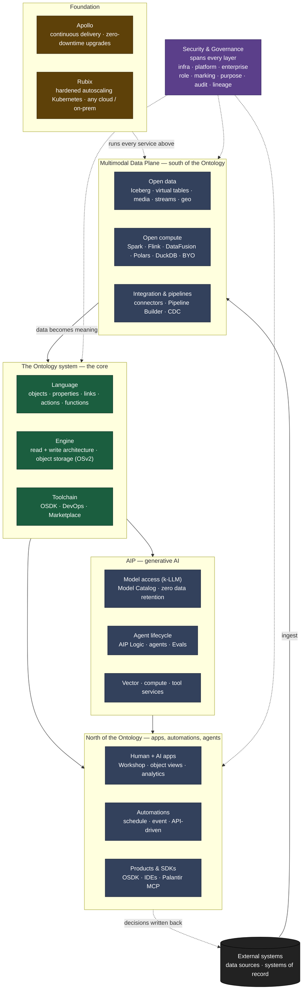

# Palantir Foundry — Overall Architecture

The full component architecture as Palantir documents it, layered from the infrastructure up to the apps, with security spanning every layer. Source of truth: Palantir's Architecture Center (linked at the bottom). This is the real Foundry; what our clone replicates versus collapses is noted under each layer.

## The layers, bottom to top

**Foundation — Apollo + Rubix.** Rubix is a hardened, autoscaling Kubernetes substrate (zero-trust, with nodes that cannot live past 48 hours) that runs identically on AWS, Azure, GCP, OCI, or on-prem. Apollo is the continuous-delivery control plane that orchestrates those deployments onto Rubix, issuing the plans that ship thousands of zero-downtime, blue/green upgrades across hundreds of services. _For our clone: dropped — ordinary deployment on a single host._

**Multimodal Data Plane (south of the Ontology).** Palantir's "any data, any compute" tier. Open data on Apache Iceberg, with virtual tables and catalogs so data is used without duplication, across tabular, media, streaming, and geospatial modalities. Open compute is a pluggable mesh — Spark and Flink for batch and streaming, DataFusion, Polars, and DuckDB for single-node, plus bring-your-own containers (Compute Modules) and pushdown to Databricks or Snowflake. Connectors, Pipeline Builder, and change-data-capture turn raw sources into Ontology-ready data. _For our clone: simplified hard — one relational store (implemented append-only / event-sourced, so the versioned-foundation invariant holds) and a thin ingestion path._

**The Ontology system (the core).** Three parts. The **Language** models the nouns and verbs: object types, properties, links, actions, and functions. The **Engine** runs it — a read architecture that queries billions of objects with real-time subscriptions, and a write architecture of atomic, durable transactions, batch mutations, streams, and CDC writeback, over OSv2 object storage. The **Toolchain** builds on it: the Ontology SDK plus DevOps and Marketplace for governed production. _For our clone: replicated faithfully — this is the irreducible core._

**AIP (generative AI).** Secure k-LLM access to any model through the Model Catalog (GPT, Claude, Gemini, Grok, Llama, and custom) with zero data retention; vector, compute, and tool services that act as an evolving tool factory; and the agent lifecycle — build with AIP Logic or Code Workspaces, evaluate with AIP Evals. Critically, agents run on the same Ontology and pass through the same default-deny controls as humans, bound to whatever identity runs the action — an interactive user, an automation owner, a project scope, or a service user. _For our clone: the recommendation path is in scope; the rest deferred._

**North of the Ontology (consumption).** Human and AI applications (Workshop, object views, object-oriented analytics), automations (schedule-, event-, and API-driven), and products, SDKs, and developer environments (OSDK, VS Code/JupyterLab, Palantir MCP). _For our clone: a reactive app layer over the object model, simplified._

**Security & Governance (woven through all).** Not a layer but three spheres spanning every layer: infrastructure security (Rubix zero-trust), platform security (role-, marking-, and purpose-based controls with automated lineage and audit), and enterprise security (identity-provider integration, encryption). Every read and write, by any human or agent, is reconciled at the moment of access. _For our clone: kept — roles, markings, row/cell policies, default-deny, and an append-only audit log._

The dynamic that ties it together is the closed loop: data flows up through the Multimodal Data Plane into meaning in the Ontology, and decisions flow back down through governed Actions to the systems of record.

---

_Sources (Palantir Architecture Center):_ [Overview](https://www.palantir.com/docs/foundry/architecture-center/overview/) · [AIP, Foundry, and Apollo](https://www.palantir.com/docs/foundry/architecture-center/platforms/) · [The Ontology System](https://www.palantir.com/docs/foundry/architecture-center/ontology-system/) · [The Multimodal Data Plane](https://www.palantir.com/docs/foundry/architecture-center/multimodal-data-plane/) · [The Rubix Substrate](https://www.palantir.com/docs/foundry/architecture-center/rubix/) · [AIP Architecture](https://www.palantir.com/docs/foundry/architecture-center/aip-architecture/)

_Not affiliated with Palantir Technologies. "Palantir," "Foundry," "AIP," "Apollo," and "Rubix" are trademarks of Palantir Technologies Inc., used here for descriptive reference only._
