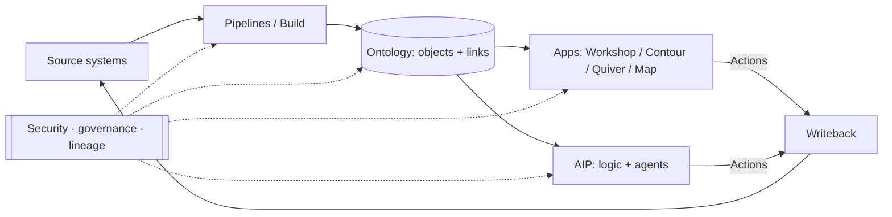

# Palantir Foundry — Conceptual Map

> **Project:** "Foundry for Unity Fiber" — an internal clone of Palantir Foundry, adapted for carrier-relations management.
> **This document:** Phase 1 — the *end state we are working backwards from*. It maps what Foundry actually does and the conceptual model underneath it. Pure Foundry; the translation to the carrier-relations role comes in Phase 2.
> **Version:** Draft 1 · 2026-06-13 · Conceptual focus (light on build mechanics by design).

---

## 0. How to read this document

This is a **specification of an idea**, not yet a specification of software. Because we're doing spec-driven development, the goal here is to understand Foundry's *model* so precisely that we can later decide, component by component, what to replicate, what to simplify, and what to drop.

The document moves from the inside out:

1. The one-sentence model and the core philosophy (what Foundry *is*).
2. The layered architecture (how the platform is organized).
3. The Ontology in depth (the irreducible core — most of the "magic" lives here).
4. A component catalog (the named tools and their jobs — useful as a vocabulary reference).
5. The end-to-end decision loop (how the pieces work together).
6. A glossary (every key term in one place).
7. The essence worth cloning, and the open questions that drive Phase 2.

Vocabulary that Foundry uses as a term of art is **bolded on first use** and collected in the glossary.

---

## 1. The one-sentence model

> **Foundry is an operational decision-making platform that builds a living, governed digital model of an organization — its things, its relationships, and its decisions — and then closes the loop from raw source data all the way to real-world action and back.**

Two phrases in that sentence carry most of the weight:

- **"Digital model of an organization."** Foundry's center of gravity is not the data and not the dashboards — it's the **Ontology**, a semantic layer that represents the real entities a business cares about (a customer, a circuit, a contract, a work order) as objects you can query, reason over, and act on.
- **"Closes the loop … back."** Most analytics tools stop at *insight* (a chart, a report). Foundry is built to capture the *decision* and write it back into systems of record — so the platform is part of operations, not just a window onto them.

---

## 2. The big idea (philosophy)

### 2.1 The problem Foundry claims to solve

Large organizations have data scattered across dozens of source systems (ERPs, CRMs, spreadsheets, sensors, billing systems). Analysts can build reports, but the *meaning* of the data — what a "customer" is, how an "order" links to a "shipment" — lives in people's heads and in brittle, one-off queries. Decisions made on top of that data rarely flow back into the systems that run the business. Foundry's pitch is to fix the **semantic gap** (data that doesn't know what it means) and the **action gap** (insight that doesn't change anything).

### 2.2 Dashboard-centric vs. decision-centric

This is the single most important distinction to internalize, because it shapes everything we'd build:

| Traditional BI / analytics | Foundry's model |
|---|---|
| Read-only insight | Read **and write** — decisions are captured |
| Built on tables/columns | Built on **objects/links** (real-world entities) |
| Logic re-implemented per report | Logic defined **once** in the Ontology, reused everywhere |
| Disconnected from operations | **Writeback** pushes decisions to systems of record |
| Governance bolted on | Governance, lineage, and security **built in** |

Palantir calls an app built this way an **operational application**: its purpose is to drive a specific decision and let users capture that decision via **writeback**, as opposed to a dashboard that only delivers read-only insight.

### 2.3 The three layers of the Ontology (Palantir's own framing)

Palantir describes the Ontology as integrating three kinds of elements. This is worth memorizing — it's the conceptual spine of the whole platform:

- **Semantic** — *what exists.* Objects, their properties, and the links between them. The nouns of the business.
- **Kinetic** — *what can happen.* Actions and functions: governed logic that changes objects and orchestrates decisions. The verbs of the business.
- **Dynamic** — *how it stays live.* Real-time security, and the continuous connection between the model and the operations it represents — a **digital twin** that updates as the business does.

### 2.4 The closed loop

The defining motion of Foundry is a loop, not a pipeline:

```
   Source systems  ──►  Data integration  ──►  Ontology (objects/links)
        ▲                                              │
        │                                              ▼
   Writeback  ◄──  Actions / decisions  ◄──  Apps + analytics + AI
```

Data flows up into meaning; decisions flow back down into systems. Everything Foundry sells — pipelines, apps, AIP, governance — exists to make some part of this loop faster, safer, or smarter.

---

## 3. The layered architecture

Foundry is best understood as a stack. From the user's point of view there are roughly five layers plus one cross-cutting concern. (At the very bottom, **Apollo** — see §3.6 — is the delivery system that keeps the whole thing running.)

```
┌─────────────────────────────────────────────────────────────┐
│  AIP — AI layer: LLM logic, agents, evals, in-platform help  │  ← reason & assist
├─────────────────────────────────────────────────────────────┤
│  Applications & analytics: Workshop, Contour, Quiver, Map…   │  ← decide & act
├─────────────────────────────────────────────────────────────┤
│  THE ONTOLOGY: objects · links · actions · functions          │  ← meaning (core)
├─────────────────────────────────────────────────────────────┤
│  Data foundation: connectors · pipelines · Build · datasets   │  ← raw → curated
├─────────────────────────────────────────────────────────────┤
│  Apollo: continuous delivery / deployment / environments      │  ← keeps it running
└─────────────────────────────────────────────────────────────┘
        ▲ Security, governance & lineage run through every layer ▲
```

### 3.1 Data foundation (integration layer)

**Job:** get data in from anywhere, turn raw inputs into clean, trustworthy, versioned datasets, and keep them fresh — with full lineage.

Key concepts and vocabulary:

- **Connectors / Data Connection** — Foundry ships 200+ out-of-the-box connectors and handles structured, semi-structured, and unstructured sources across batch, micro-batch, and streaming.
- **Dataset** — the fundamental unit of stored data. Datasets are **versioned**, **branchable** (git-like), schema-aware, and carry **lineage**.
- **Transform / Build** — the system that produces datasets from other datasets. "Build" is a compute-agnostic framework with security and lineage baked in; it can mix and match compute runtimes.
- **Pipeline** — a directed graph of transforms that turns raw source data into curated, ontology-ready datasets.
- **Pipeline Builder** — the no-/low-code tool for building pipelines (Foundry's primary data-integration app).
- **Code Repositories / Code Workbook** — code-first authoring (PySpark, Python, SQL, Java) for transforms that need real code; Code Workbook is the interactive/exploratory variant.
- **Data health / expectations** — checks and monitors that enforce data quality and freshness on pipelines.

### 3.2 The Ontology (core) — summarized here, expanded in §4

**Job:** turn curated datasets into a semantic, operational model of the business — objects you can search, link, reason over, and *change*. This is the layer that makes Foundry "Foundry." Full treatment in §4.

### 3.3 Analytics & application layer

**Job:** let people explore the Ontology and build the operational apps where decisions actually get made.

- Analytical/exploration tools: **Contour** (point-and-click analytical pipelines), **Quiver** (charting, time-series, multimodal analysis), **Object Explorer** (search/discover objects, build object sets), **Map** (geospatial), **Vertex** (graph/network), **Notepad / Reports** (live-data documents).
- App builders: **Workshop** (the primary no-code builder for operational apps; low-to-moderate complexity, low maintenance) and **Slate** (HTML/JS power-user builder for heavily customized apps, higher maintenance). These consume the Ontology natively.

### 3.4 AIP (the AI layer)

**Job:** connect LLMs and agents to the Ontology so AI can reason over *governed, real* enterprise data and trigger *governed* actions — not just chat.

- **AIP Logic** — a no-code environment for building LLM-powered functions/workflows on top of the Ontology.
- **AIP Agent Studio / Chatbot Studio** — build and manage agents that use Ontology objects, functions, and actions as tools.
- **AIP Evals** — evaluation suites that measure AI performance against expected results.
- **AIP Assist** — in-platform AI assistant (help, pipeline/app generation from natural language).
- Governed model access — a managed gateway to many LLMs/multimodal models with access controls, auditing, and lineage.

### 3.5 Security, governance & lineage (cross-cutting)

**Job:** make all of the above safe to use on sensitive data, by default, at every layer. Covered in §4.5 and the glossary: **markings**, **restricted views** (row-level security), **classification-/purpose-based access controls**, **object security policies**, and end-to-end **data lineage/provenance**.

### 3.6 Apollo (delivery layer)

**Job:** the continuous-delivery system beneath Foundry and AIP. Apollo orchestrates thousands of zero-downtime upgrades across hundreds of services and can promote Foundry products across isolated, even cloud-disconnected, environments. It's "natively aware" of Foundry's object model, so a deployment is versioned operational logic, not just a code bundle. Together, **AIP + Foundry + Apollo** are marketed as an "Enterprise Operating System."

> For our clone this layer is mostly out of scope early on — but it's worth knowing it exists, because "how do we deploy and version the Ontology and apps safely" is a real question we'll eventually face.

---

## 4. The Ontology, in depth

If we clone only one thing well, it's this. The Ontology is the semantic + kinetic + dynamic layer that sits **on top of** integrated datasets and models, and connects them to their real-world counterparts. Everything above it (apps, AIP) and the value of everything below it (pipelines) flows through here.

A useful mental model: **the Ontology is a shared, governed, living data model of the business that is simultaneously a database, an API, a permission system, and a workflow engine.**

### 4.1 The semantic layer — *what exists*

- **Object type** — the definition of a kind of entity or event in the business: `Customer`, `Circuit`, `Carrier`, `Order`, `Outage`. (A *schema* for a real-world noun.)
- **Object** — a single instance of an object type: the carrier "Lumen," the circuit "CKT-00421." Objects are the things users see, search, and manipulate.
- **Property** — an attribute of an object type: a circuit's bandwidth, a carrier's account manager, an order's status. Some properties are **mandatory control properties** used to drive security.
- **Link type** — a defined relationship between two object types: a `Carrier` *provides* many `Circuits`; an `Order` *belongs to* a `Customer`. Links are first-class — they're how you traverse the model.

Together these unify many disparate source datasets into **coherent objects, properties, and links** that every stakeholder interacts with the same way. The underlying datasets still exist; the Ontology is the meaning laid over them.

> **Object backend / Object Storage.** Behind the scenes, an indexed store makes objects searchable and writable in (near) real time, rather than forcing every question back through batch pipelines. This is what lets objects feel "live" and support writeback.

### 4.2 The kinetic layer — *what can happen*

This is the part that separates Foundry from a normal data model. The Ontology doesn't just describe the business — it lets you **change** it in governed ways.

- **Action type** — a centralized, governed definition of *how* an object can be modified: create an object, edit properties, add/remove links. Actions are the **only** sanctioned way to write back into the Ontology, which means edits are consistent, validated, and audited no matter which app triggers them. When a user takes an action, the change commits to the Ontology and is reflected everywhere instantly.
- **Function** — reusable business logic of arbitrary complexity, authored in **TypeScript** or **Python**. Functions can compute, validate, and (via **function-backed actions**) perform complex writeback. They run fast enough for interactive apps and are the substrate AIP uses to give AI real "tools."
- **Function-backed action** — an action whose logic is a function, enabling complex, multi-object edits beyond simple built-in create/modify operations.

The pattern to remember: **define the logic once (function), expose it as a governed change (action), and every app and agent gets the same validated behavior for free.**

### 4.3 The dynamic layer — *staying live and governed*

The Ontology is meant to be a **digital twin**: as operations change, the model changes, and security adapts in real time. Properties on objects can drive who may see or do what (see §4.5), so the security model is part of the live data, not a static wrapper.

### 4.4 Why this is powerful (the four reuses)

Defining a concept once in the Ontology pays off four ways simultaneously:

1. **One definition, every app** — `Circuit` means the same thing in Workshop, Quiver, a map, and an AIP agent.
2. **One logic, every surface** — a validation written once applies to a human clicking a button and an agent calling a tool.
3. **One permission model, every access path** — security travels with the object, not the app.
4. **One lineage, end to end** — you can trace any object value back to the source row that produced it.

### 4.5 Security & governance (how the Ontology stays safe)

- **Markings** — access-control tags on files/folders/projects; to use a resource a user must hold *all* of its markings. The blunt, powerful instrument.
- **Restricted views** — **row-level** security: a policy decides which rows of a dataset a given user may see.
- **Object security policies** — view permissions configured on the object type itself (row-level security at the object layer), independent of the backing dataset's permissions.
- **Classification- / purpose-based access controls** — access granted by data classification and by the declared *purpose* for which someone is accessing data.
- **Granular permissions & lineage** — fine-grained role/classification controls plus full provenance, so governance is auditable enterprise-wide.

---

## 5. Component catalog (vocabulary reference)

A quick-reference map of the named tools. Think of this as the "parts list" — when we spec the clone, each row is a build-or-skip decision.

### Data foundation
| Component | What it's for |
|---|---|
| **Data Connection / Connectors** | Bring data in from 200+ sources (batch, streaming, files, APIs). |
| **Pipeline Builder** | No-/low-code pipelines (primary data-integration tool). |
| **Code Repositories** | Git-backed, code-first transforms (PySpark/SQL/Java/Python). |
| **Code Workbook** | Interactive, exploratory code analysis. |
| **Datasets + Build** | Versioned, branchable data + the compute system that produces it. |

### The Ontology
| Component | What it's for |
|---|---|
| **Object / Object type** | Real-world entities and their schemas. |
| **Property** | Attributes of an object. |
| **Link type** | Governed relationships between objects. |
| **Action type** | The sanctioned, governed way to write back / change objects. |
| **Function** | Reusable TS/Python business logic; backs actions and AI tools. |

### Analytics & exploration
| Component | What it's for |
|---|---|
| **Object Explorer** | Search/discover objects, build and refine object sets. |
| **Contour** | Point-and-click analytical pipelines over data. |
| **Quiver** | Charting, time-series, and multimodal analysis. |
| **Map** | Geospatial analysis of objects. |
| **Vertex** | Graph / network analysis. |
| **Notepad / Reports** | Live-data documents and reporting. |

### Applications
| Component | What it's for |
|---|---|
| **Workshop** | Primary no-code builder for operational apps (low maintenance). |
| **Slate** | HTML/JS power-user app builder for heavy customization. |
| **Object Views** | Configurable, focused views of a single object. |

### AI (AIP)
| Component | What it's for |
|---|---|
| **AIP Logic** | No-code builder for LLM-powered functions/workflows. |
| **AIP Agent / Chatbot Studio** | Build & manage agents that use objects, functions, actions as tools. |
| **AIP Evals** | Measure and benchmark AI performance. |
| **AIP Assist** | In-platform AI helper (guidance, generation from natural language). |
| **Modeling Objectives / Foundry ML** | Manage, evaluate, and connect ML models to the Ontology. |

### Operations & distribution
| Component | What it's for |
|---|---|
| **Marketplace** | Package and distribute reusable Foundry products/templates. |
| **Apollo** | Continuous delivery; promote and version across environments. |
| **Markings / Restricted views / Policies** | The layered security model (see §4.5). |

---

## 6. The end-to-end decision loop (how it fits together)

A concrete walk-through of the motion, using a carrier-relations-flavored example so it's tangible:

1. **Integrate.** Connectors pull carrier data, circuit inventory, billing, and tickets into **datasets**. **Pipeline Builder** cleans and joins them.
2. **Model.** Those datasets map onto **object types** — `Carrier`, `Circuit`, `Contract`, `Outage` — with **properties** and **link types** (a carrier *provides* circuits; an outage *affects* circuits).
3. **Explore.** A manager uses **Object Explorer / Quiver / Map** to find, say, every circuit from a carrier with degraded SLA this quarter.
4. **Decide & act.** In a **Workshop** app, she clicks a button that triggers an **action** ("open escalation," "flag for renegotiation"). The action runs a **function** that validates the change and **writes it back** to the Ontology — and onward to the systems of record.
5. **Assist.** An **AIP** agent drafts the escalation summary, reasoning over the *same* governed objects and calling the *same* actions as tools.
6. **Govern.** Throughout, **markings / policies** ensure she only sees what she's allowed to, and **lineage** lets anyone trace a number back to its source.



---

## 7. Glossary

- **Action type** — Governed definition of how objects may be changed; the only sanctioned writeback path.
- **AIP (Artificial Intelligence Platform)** — Foundry's AI layer: governed LLMs, agents, logic, and evals over the Ontology.
- **Apollo** — Continuous-delivery platform that deploys/versions Foundry & AIP across environments.
- **Build** — Compute-agnostic system that produces datasets from transforms, with security and lineage built in.
- **Connector / Data Connection** — Integration points to source systems (200+ available).
- **Contour** — Point-and-click analytical pipeline / data-exploration app.
- **Dataset** — Fundamental, versioned, branchable unit of stored data.
- **Digital twin** — The Ontology as a live model mirroring the real organization.
- **Function** — Reusable TS/Python business logic; can back actions and serve as AI tools.
- **Kinetic layer** — Actions + functions: the parts of the Ontology that *change* things.
- **Lineage / provenance** — End-to-end traceability from source data to objects to apps.
- **Link type** — A defined, governed relationship between two object types.
- **Marking** — Access-control tag; users must hold all of a resource's markings to use it.
- **Object / Object type** — A real-world entity/event instance / its schema.
- **Object backend (Object Storage)** — Indexed store enabling real-time search and writeback on objects.
- **Ontology** — Foundry's semantic+kinetic+dynamic model of the business; the platform's core.
- **Operational application** — An app built to drive a decision and capture it via writeback (vs. a read-only dashboard).
- **Pipeline / Pipeline Builder** — A graph of transforms / the no-code tool to build it.
- **Property** — An attribute of an object type.
- **Restricted view** — Row-level security policy on a dataset.
- **Semantic layer** — Objects, properties, links: the parts of the Ontology that *describe* things.
- **Slate** — Power-user (HTML/JS) app builder for heavy customization.
- **Workshop** — Primary no-code operational-app builder.
- **Writeback** — Committing a user/agent decision into the Ontology and onward to systems of record.

---

## 8. The essence worth cloning — and what's next

### 8.1 The irreducible core

If we strip Foundry to the concepts we'd *have* to honor for a clone to be "Foundry-like" (regardless of what tech we build it on), it's these five:

1. **A semantic object/link model** sitting over integrated data — not tables, but real-world *things* and their relationships.
2. **Governed actions + reusable functions** — change is defined once, validated, and audited, no matter who or what triggers it.
3. **Writeback / the closed loop** — decisions flow back to systems of record; the tool is part of operations.
4. **Security that travels with the data** — row-/object-level, classification-/purpose-aware, on by default.
5. **End-to-end lineage** — every value is traceable to its source.

Everything else (the specific apps, AIP, Apollo, 200+ connectors) is *surface area* we can scope up or down. These five are the spine.

### 8.2 What's deliberately out of scope here

Per the plan, this document stays pure-Foundry. It does **not** yet decide what to build, what tech stack to use, or how any of this maps to carrier relations — those are the next phases.

### 8.3 Open questions that drive Phase 2 (mapping to the carrier-relations role)

When we sit down to adapt this to the manager at Unity Fiber, these are the questions this map sets up:

- **What are her objects?** (Carriers, circuits, contracts, NNIs, tickets, SLAs, escalations…?) — i.e., what is *her* Ontology?
- **What are her links?** How do those entities relate in the way she actually works?
- **What decisions does she make repeatedly** that we'd model as *actions* with writeback?
- **Where does her data live today** (spreadsheets, carrier portals, a CRM, email) — i.e., what are the connectors?
- **What's read-only insight vs. a real operational decision** for her — so we know where the closed loop matters most.
- **Which of the five core concepts give her the most value first** — almost certainly the semantic model + a couple of high-value actions, long before anything like AIP or Apollo.

> **Suggested next step:** a short discovery on the carrier-relations role, structured around those six questions, producing *her* object/link/action list — the Phase-2 spec that we map back onto this Phase-1 model.

---

## Sources

- [Palantir Foundry — platform](https://www.palantir.com/platforms/foundry/) · [Ontology](https://www.palantir.com/explore/platforms/foundry/ontology/)
- [Docs: Ontology overview](https://www.palantir.com/docs/foundry/ontology/overview) · [Core concepts](https://www.palantir.com/docs/foundry/ontology/core-concepts) · [Object backend](https://www.palantir.com/docs/foundry/object-backend/overview) · [The Ontology system](https://www.palantir.com/docs/foundry/architecture-center/ontology-system)
- [Docs: Data integration overview](https://www.palantir.com/docs/foundry/data-integration/overview) · [Pipeline Builder](https://www.palantir.com/docs/foundry/pipeline-builder/overview) · [Platform architecture](https://www.palantir.com/docs/foundry/platform-overview/architecture)
- [Docs: Action types](https://www.palantir.com/docs/foundry/action-types/overview) · [Functions](https://www.palantir.com/docs/foundry/functions/overview) · [Operational applications](https://www.palantir.com/docs/foundry/app-building/operational-apps)
- [Docs: Application reference](https://www.palantir.com/docs/foundry/getting-started/application-reference) · [Ontology-aware applications](https://www.palantir.com/docs/foundry/ontology/applications)
- [Docs: AIP overview](https://www.palantir.com/docs/foundry/aip/overview) · [AIP features](https://www.palantir.com/docs/foundry/aip/aip-features) · [AIP capabilities](https://www.palantir.com/docs/foundry/platform-overview/aip-capabilities)
- [Docs: Markings](https://www.palantir.com/docs/foundry/security/markings) · [Restricted views](https://www.palantir.com/docs/foundry/security/restricted-views) · [Object security policies](https://www.palantir.com/docs/foundry/object-permissioning/object-security-policies)
- [Docs: AIP, Foundry & Apollo](https://www.palantir.com/docs/foundry/architecture-center/platforms) · [Apollo technical white paper](https://www.palantir.com/assets/xrfr7uokpv1b/3B5KbQ9ujsiDCX4Tnfz3Hy/8d3ee9a6911665f036ce3d28c19cfa0d/PalantirApolloTechnicalWhitePaper.pdf)

