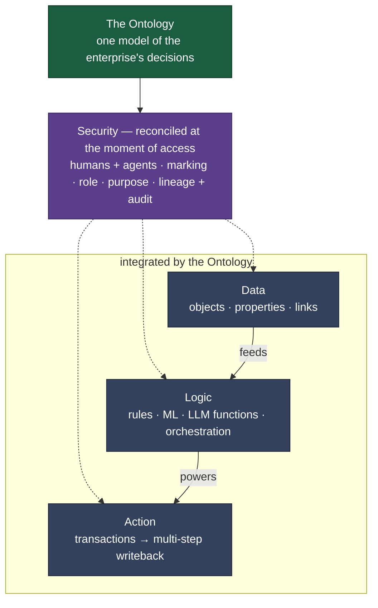
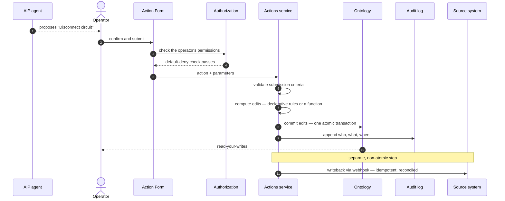
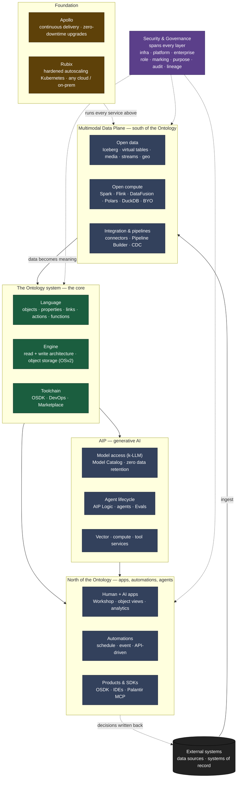

# Specs - very tentative rough draft - everything subject to change 

Foundry takes a company's scattered data and turns it into a single live model of the business: its customers, circuits, contracts, and the operations that act on them. People and AI change that model only through governed, recorded actions. This spec defines a smaller system built on the same model, and says which parts to replicate, which to simplify, and which to drop. Every call is grounded in primary-source research.

##  loop

The platform that surfaces the losing circuit is also where the disconnect happens, and the change is governed, recorded, and written straight back to the systems of record. Data flows up into meaning; decisions flow back down into the systems that run the business.

## How it works

This section follows Palantir's own architecture documentation, which is the source of truth here (Architecture Center: _The Ontology System_ and _AIP, Foundry, and Apollo_). At the center is the **Ontology**: one operational model of the enterprise's decisions, built from the four-fold integration of **data, logic, action, and security**. 

**The four-fold.** The Ontology integrates data, logic, and action, with security threading through all three rather than bolted onto the side. Every read and write, by a person or an agent, is reconciled against marking, role, and purpose at the moment of access.

Palantir splits the Ontology system itself into three parts: a **Language** that defines the model (objects, properties, links, plus actions, automations, and the logic behind them), an **Engine** that runs it (a read architecture of high-scale queries, real-time subscriptions, and materializations, and a write architecture of atomic transactions, batch mutations, streams, and change-data-capture), and a **Toolchain** that builds on it (the Ontology SDK and DevOps tooling for governed production).

**One decision** A recommendation becomes a governed, validated, audited Action that commits to the Ontology as one atomic transaction. Propagating that decision to an external system of record is a separate step: no transaction spans Foundry and an outside system, so the writeback is idempotent and reconciled, not two-phase. For the clone we choose a human-in-the-loop policy — the AIP agent proposes the Action and an operator submits it under their own permissions. (In Foundry, automated actions can also run as an automation owner, a project scope, or a service user.)

## Architecture

The same model as the full component stack, the way Palantir's Architecture Center layers it: infrastructure at the base, the apps at the top, security spanning all of it. 

**Data Plane.** Open data on Apache Iceberg with virtual tables, and a pluggable compute mesh (Spark, Flink, DataFusion, Polars, DuckDB, bring-your-own); connectors and change-data-capture turn raw sources into Ontology-ready data. for us: one relational store and a thin ingest path — but implemented append-only / event-sourced so the versioned-foundation invariant holds (an immutable edit log is the source of truth, current state is a projection; note Postgres has no native temporal tables)._

**Ontology** The core, in three parts: a Language (objects, properties, links, actions, functions), an Engine (read and write architecture over OSv2 object storage), and a Toolchain (OSDK, DevOps, Marketplace). 

**AIP** Secure k-LLM access to any model, vector and tool services, and the agent lifecycle (AIP Logic, Evals). Agentic actions pass through the same Ontology and the same default-deny controls as a human, evaluated against whatever identity runs them — an interactive user, an automation owner, a project scope, or a service user. 

**North of the Ontology.** Human and AI applications (Workshop), automations, and products, SDKs, and developer environments.

**Security & Governance.** Not a layer but three spheres spanning every one — infrastructure, platform (role-, marking-, and purpose-based controls with lineage and audit), and enterprise. _Clone: kept — roles, markings, row/cell policies, default-deny, and an append-only audit log._

## Why

Five why's

| Invariant                          | The idea                                                                                                                                                  |
| ---------------------------------- | ------------------------------------------------------------------------------------------------------------------------------------------------------------- |
| **Semantic model over data**       | People work with real things (a Circuit, a Carrier) instead of tables and columns, and each is defined once and reused everywhere.                            |
| **Versioned data foundation**      | The data underneath is immutable and historied; any value traces back to where it came from.                                                                  |
| **Governed writeback**             | Every change goes through a defined, validated, audited Action, never an ad-hoc edit. The rule is written once and holds no matter who, or what, triggers it. |
| **Security travels with the data** | Access belongs to the objects and rows themselves, on by default and checked on every query, rather than bolted onto each app.                                |
| **End-to-end lineage**             | Source → dataset → object → action → audit forms one continuous, inspectable chain.                                                                           |

The only way to change anything is an Action, and every Action validates and records itself. That is why the AI layer is safe: an agent can act only through the same governed Action and the same default-deny gate as a human, under whatever identity runs it and in the clone, we keep that identity the human operator.

---

